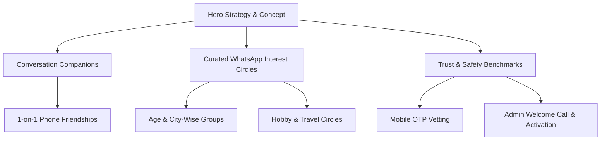
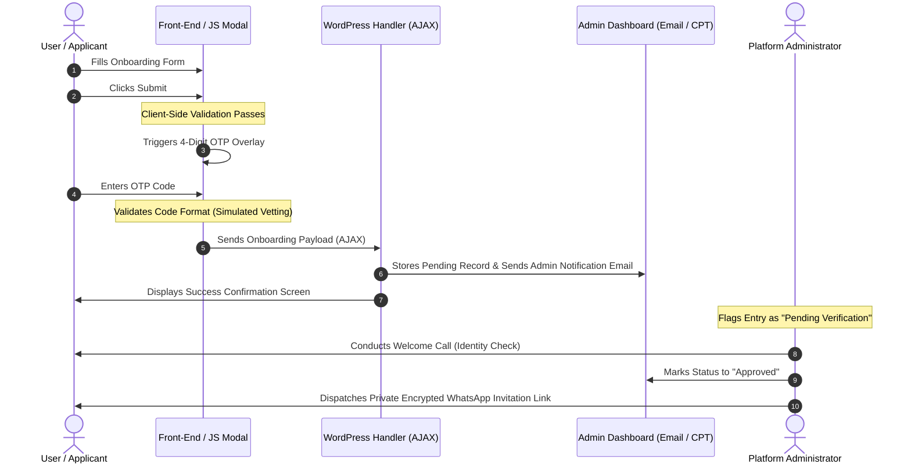

# SecondInnings50 — MVP Architecture, Onboarding Flow & Feature Blueprint

This document serves as the official, client-ready technical manual and system architecture blueprint for **SecondInnings50**, a premium companionship-and-community platform tailored specifically for India's 45–60 mature adult demographic. It details the product philosophy, onboarding workflows, safety enforcements, and structural engines designed to run efficiently on lightweight, cost-effective hosting platforms.

---

## 1. Executive Concept Summary

### Mission & Core Philosophy
Active adults aged 45–60 possess unique wisdom, emotional maturity, and the desire to build fresh connections. As careers stabilize and children begin their independent lives, these adults seek meaningful conversations, shared interest circles, travel companions, and the potential for long-term relationships or shared life partnerships. 

SecondInnings50 is built to address this specific need by offering a dignified, gated digital neighborhood. Rather than utilizing gamified, superficial swipe mechanisms, the platform is anchored around **Safety, Dignity, and Meaningful Engagement**.

### Core Value Pillars
1. **Curated Safety:** High-contrast, highly vetted enrollment designed to eliminate spam, bots, and bad actors.
2. **Organic Companionship:** Interest-driven circles (books, retro music, finance, gardening) that facilitate organic friendship before formal matching.
3. **Structured Travel:** Regional group travel and sacred Teerth Yatras planned for comfort, safety, and compatibility.
4. **Human Touch Vetting:** Leveraging automated checks coupled with a mandatory welcome verification call to foster human trust and accountability.

---

## 2. Core Features Overview



### Hero Strategy & Visual Tone
The website visual interface is optimized for the target demographic:
* **Branding Palette:** Sophisticated combinations of Forest Green (`#1B3B2B`) representing stability, Terracotta (`#C05C3E`) representing warmth, and Gold (`#C5A059`) indicating premium trust.
* **Accessibility:** Generous font sizing (Plus Jakarta Sans and Playfair Display), distinct form field outlines (solid 1.5px borders), and high-contrast styling (pure white input backgrounds) to prevent eye strain.
* **Imagery:** Focused on relatable, warm portrayals of mature Indian adults (e.g., sharing tea on a terrace garden, enjoying walks) rather than generic corporate stock photos.

### Conversation Companions
A high-touch service designed to combat social isolation. Refined peers are manually matched for scheduled, 1-on-1 voice calls. This serves strictly as a social friendship circle, focusing on intellectual dialogue, literature, retro movies, or life journeys.

### Curated WhatsApp Interest Circles
To minimize operational overhead during the initial MVP phase, community interaction is routed into a network of managed WhatsApp Groups:
* **Age-Wise Sub-Groups:** 45–50, 51–55, 56–60, and 60+ to ensure peer alignment.
* **City & Regional Groups:** Connecting members locally within Mumbai, Delhi-NCR, Pune, Bangalore, Chennai, and other metro hubs.
* **Hobby & Activity Circles:** Focus spaces for Gardening, Poetry/Literature, Wellness/Yoga, and personal finance.

### Trust & Safety Benchmarks
The platform enforces a "Gated Community" policy:
* **Confidentiality:** Phone numbers and full profiles remain hidden from public view. They are only shared inside verified, private, admin-moderated environments.
* **Content Moderation:** Strictly enforced guidelines preventing the sharing of forward chains, political content, religious debates, or advertising.

---

## 3. End-to-End Onboarding Lifecycle Blueprint

The SecondInnings50 onboarding lifecycle is designed as a secure, three-tier framework that ensures maximum security with minimal complex database configuration:



### Stage 1: Form Intake & Mobile OTP Overlay
1. The applicant completes either the quick invitation request form on the homepage (specifying Name, Email, WhatsApp Phone, and **Gender**) or the comprehensive 13-field onboarding form on [page-join.php](file:///c:/Users/tarig/Desktop/Freelancer%20pank/page-join.php).
2. Upon submission, JavaScript performs client-side field validation.
3. Once validated, instead of executing the server call immediately, a **premium glassmorphic OTP Overlay** modal is triggered.
4. The system-simulated OTP overlay prompts the user to enter a 4-digit code sent to their WhatsApp number. 
5. Entering the 4 digits confirms device ownership. Once verified, the modal closes, and the AJAX request is submitted to WordPress.

### Stage 2: Administrative Gating
1. The AJAX request is processed securely by `functions.php`.
2. Verified applications are immediately stored under a "Pending Vetting" status tag (sent to the administrative panel and notified via secure email routing).
3. The applicant's contact details, age, and location remain entirely private and gated, ensuring they cannot be parsed by search engines or scraped by unauthorized visitors.

### Stage 3: The Welcome Validation Call
1. An administrator receives the application notification.
2. The administrator reviews the data points (focusing on the **Emergency Contact** and profession verification).
3. The admin schedules and performs a brief, friendly welcome call. This phone interaction serves to confirm identity, check basic compatibility, and clarify community rules.
4. Once vetted, the admin changes the record status to "Approved" and transmits an encrypted invite link allowing the new member entry into the private, moderated WhatsApp Interest Circles.

---

## 4. The Women Member Launch Strategy

To foster a balanced and highly secure environment, the platform operates a dual-tier onboarding membership structure:

| Metric | Women Onboarding Path | Men Onboarding Path |
| :--- | :--- | :--- |
| **Verification Tier** | Complimentary Premium Verification | Paid Verification Contribution |
| **Admission Mode** | Invitation-Only / Admin Vetted | Invitation-Only / Admin Vetted + Fee |
| **Verification Cost** | ₹0 (For first 100 registrations) | Nominal fee to cover manual checks |
| **Membership Type** | Free Lifetime Basic Membership | Standard Subscription Plan |
| **Verification Priority** | Expedited (Under 24 Hours) | Standard Queue |

### Product Logic & Strategic Positioning
* **Fostering a Safe Environment:** By offering free, premium-vetted lifetime accounts to the first 100 women members, the platform creates an early, active community of verified female users. This immediately establishes a high trust index.
* **Strict Entry Gating for Men:** Men undergo the same administrative phone vetting, but are routed through a paid verification path. This nominal fee filters out non-serious profiles and helps offset the costs of background checks, manual vetting, and host moderation.
* **Corporate Notice blocks:** This strategic launch incentive is highlighted prominently in both the home page CTA block and the Join form to increase enrollment conversions during the initial marketing push.

---

## 5. The Travel & Teerth Yatra Matrix Engine

Group travel is a core pillar for relationship building. The Travel Matrix captured during onboarding is engineered to map profiles, enabling automated or admin-led companion suggestion matching:

```
[Onboarding Inputs]
 ├── Travel Destinations Chosen (Ayodhya, Varanasi, Tirupati, Kerala, etc.)
 ├── Travel Style Selected (Spiritual, Heritage, Nature, Getaway)
 └── Companion Preferences (Group, Women-Only, Couples)
       │
       ▼
 [Vetting Approval]
       │
       ▼
 [Manual / Automated Interest Alignment]
       │
       ▼
 [Admin Invite to Private WhatsApp Travel Circles]
```

### Destination Profiles
1. **Spiritual Teerth Yatras:** Ayodhya Dham, Haridwar & Rishikesh, Varanasi (Kashi Corridor), Tirupati Balaji, Ujjain Mahakal, Jagannath Puri, Vaishno Devi, Khatu Shyam Ji, and Salasar Balaji.
2. **Leisure & Heritage Escapes:** Udaipur (palaces), Kashmir Valley (shikara retreats), Kerala Backwaters (houseboats), Goa (beaches), and Shimla & Manali (hills).

### Scaling & Travel Security Benefits
* **Safety Discounts:** Aggregating travel interest data allows the platform to secure group bookings and safety discounts for solo travelers, single mothers, and widowers.
* **Emergency Preparedness:** By requiring a mandatory **Emergency / Family Contact Number** during intake, the travel organizers ensure a direct line of contact is established before departure, addressing a critical concern for mature adults.
* **Social Compatibility:** Admin panels filter applications based on destination and style choices, ensuring that mature travelers are grouped with like-minded companions of similar physical pacing and interest preferences.

---
*Document Version: 1.2.0*  
*Target Release: Milestone 2 MVP Review*  
*Platform Environment: WordPress Core 6.x / PHP 8.x / GoDaddy Shared Hosting*
